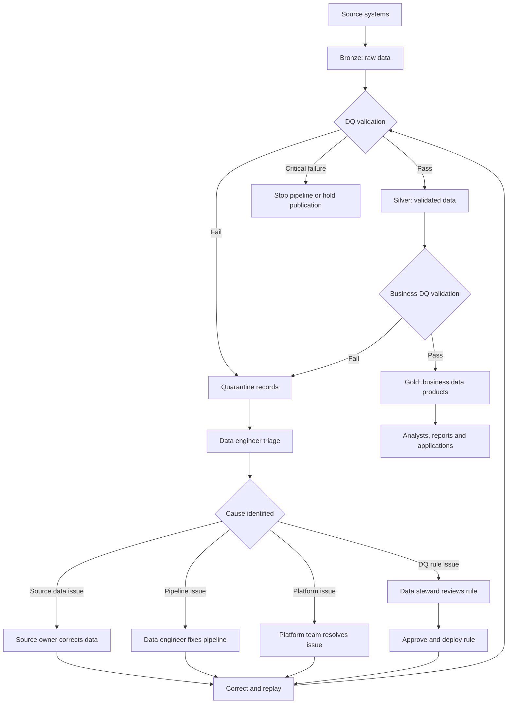
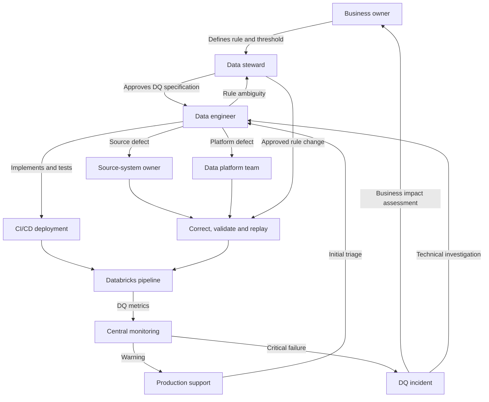
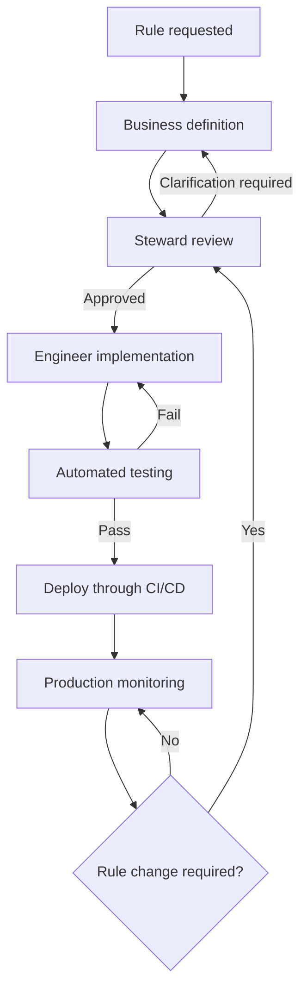
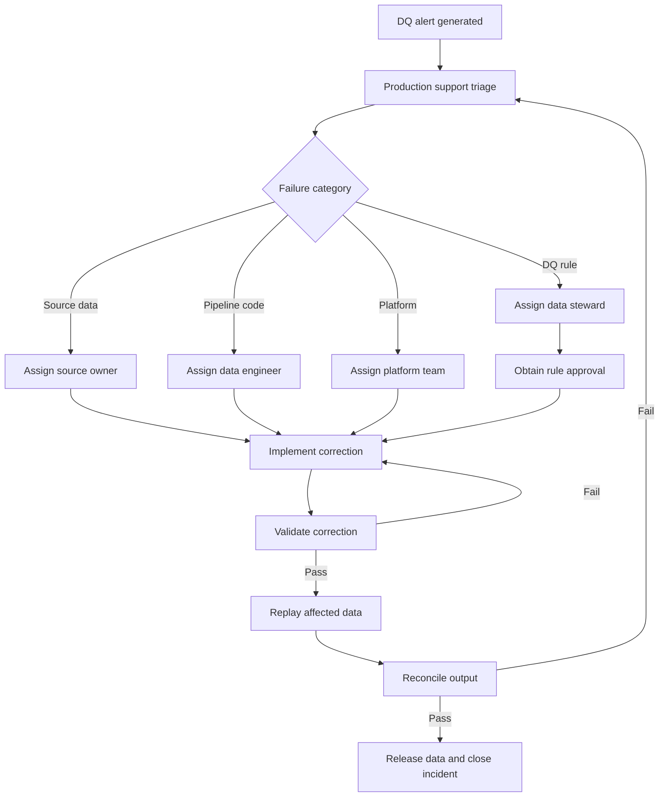

# Data Quality Controls SOP and Implementation in Databricks

## 1. Recommended Data Architecture

Data quality controls should operate across the complete data lifecycle.

Quarantine should be treated as an exception-handling branch rather than a mandatory layer through which every record passes.



Recommended flow:

> **Bronze → DQ Validation → Silver → Business DQ Validation → Gold**

Failed records branch into:

> **Quarantine → Investigation → Correction → Replay**

---

## 2. User and Ownership Flow



---

## 3. DQ Controls by Data Layer

| Stage | DQ controls | Failure handling |
|---|---|---|
| Source ingestion | File arrival, file readability, expected file count and source availability | Alert source owner or stop ingestion |
| Bronze | Schema conformity, corrupt records, mandatory metadata and duplicate-file checks | Preserve raw data and quarantine malformed records |
| Bronze to Silver | Null checks, datatype checks, valid ranges, uniqueness, deduplication and referential integrity | Warn, quarantine, drop with approval, or fail pipeline |
| Silver | Source reconciliation, record counts, control totals, completeness and cross-dataset consistency | Hold downstream publication and raise incident |
| Silver to Gold | Business rules, dimensional integrity, aggregation reconciliation and reporting-period validation | Prevent Gold refresh for critical failures |
| Gold | KPI reasonableness, freshness, SLA and consumer acceptance controls | Mark data product unhealthy and notify consumers |
| Platform | Pipeline availability, schema drift, freshness, volume anomalies, cost and DQ trends | Central monitoring, alerting and escalation |

---

## 4. Ownership Model

| Role | Responsibilities |
|---|---|
| Business owner | Defines business rules, acceptable thresholds and business impact |
| Data owner | Accountable for the quality and usability of the data product |
| Data steward | Maintains rule definitions, classifications, approvals and exceptions |
| Data engineer | Implements controls, quarantine logic, reconciliation and replay |
| Data platform team | Provides reusable frameworks, monitoring, access controls and standards |
| Production support | Monitors alerts, performs initial triage and coordinates recovery |
| Source-system owner | Corrects upstream data defects |
| Data consumer | Confirms that Gold datasets satisfy reporting and analytical requirements |

Guiding principle:

> **The platform team owns the DQ capability, data engineering owns its implementation, and the business owns the rules and acceptance thresholds.**

---

## 5. DQ Rule Lifecycle



---

## 6. End-to-End Operating Procedure

| Step | Owner | Activity | Databricks implementation |
|---|---|---|---|
| 1 | Business owner | Define rule, threshold and business impact | DQ rule catalogue |
| 2 | Data steward | Review and approve rule | Rule approval and version history |
| 3 | Data engineer | Implement validation | Lakeflow expectations or reusable SQL/PySpark checks |
| 4 | Data engineer | Test positive, negative, null and boundary cases | Automated pipeline tests |
| 5 | Engineering team | Review and deploy code | Git, CI/CD and Databricks Asset Bundles |
| 6 | Databricks pipeline | Validate each data load | Bronze-to-Silver and Silver-to-Gold checks |
| 7 | Databricks pipeline | Isolate invalid records | Quarantine Delta table |
| 8 | Production support | Monitor quality metrics and failures | Event logs, dashboards and alerts |
| 9 | Data engineer | Identify the cause | Lineage, audit logs and pipeline run history |
| 10 | Responsible owner | Correct source, rule, code or platform issue | Controlled remediation |
| 11 | Data engineer | Reprocess corrected records | Replay from Bronze or Quarantine |
| 12 | Data owner | Confirm recovery and close incident | Incident record and DQ trend reporting |

---

## 7. Failure Policies

### Warn

Use `WARN` when:

- The issue does not make the dataset unusable.
- Processing can continue safely.
- The failure rate must still be measured.
- The problem requires monitoring but not immediate intervention.

### Quarantine

Use `QUARANTINE` when:

- Individual invalid records can be separated.
- Valid records can continue safely.
- Failed records need investigation or correction.
- Replay is required after remediation.

### Fail

Use `FAIL` when:

- Primary keys are invalid.
- Reconciliation differences exceed the approved threshold.
- Critical reference data is missing.
- Publishing the dataset could produce incorrect business decisions.
- The dataset violates a regulatory or financial control.

### Drop

Dropping records should only be allowed when:

- The business owner has explicitly approved it.
- The dropped-record count remains measurable.
- The rule and justification are documented.
- Dropped records are not required for audit or replay.

Records should never be silently discarded.

---

## 8. Quarantine Table Requirements

Every quarantined record should contain:

| Field | Purpose |
|---|---|
| `source_system` | Identifies the originating system |
| `source_record_id` | Identifies the original record |
| `source_file_name` | Identifies the source file when applicable |
| `ingestion_timestamp` | Records when the data arrived |
| `pipeline_run_id` | Connects the record to a pipeline execution |
| `dq_rule_id` | Identifies the failed rule |
| `dq_rule_name` | Provides a readable rule description |
| `failure_reason` | Explains why the record failed |
| `failure_severity` | Indicates critical, high, medium or informational severity |
| `quarantine_timestamp` | Records when the failure occurred |
| `original_payload` | Preserves the original data |
| `remediation_status` | Tracks pending, corrected, rejected or replayed status |
| `replay_timestamp` | Records when the corrected record was reprocessed |

Quarantine access must follow the same or stronger security classification as the source data.

---

## 9. Incident and Remediation Flow



---

## 10. Databricks Components

| Requirement | Databricks capability |
|---|---|
| Row-level validation | Lakeflow Declarative Pipelines expectations |
| Warn, drop or stop processing | Expectation violation policies |
| Invalid-record isolation | Delta quarantine tables |
| Raw-data preservation | Bronze Delta tables |
| Data governance | Unity Catalog |
| Ownership and access control | Unity Catalog privileges |
| Data lineage | Unity Catalog lineage |
| Freshness and completeness monitoring | Data Quality Monitoring |
| Statistical profiling and drift | Data profiling |
| Pipeline-level DQ metrics | Lakeflow pipeline event logs |
| Operational reporting | Databricks SQL dashboards |
| Notifications | Databricks SQL or workflow alerts |
| Deployment | Databricks Asset Bundles and CI/CD |
| Auditability | Unity Catalog and Databricks system tables |

---

## 11. Monitoring Metrics

The central DQ dashboard should include:

- Total records processed
- Records passed
- Records failed
- Records quarantined
- DQ pass percentage
- Failure count by rule
- Failure count by source
- Failure count by severity
- Freshness and SLA status
- Source-to-target reconciliation difference
- Unresolved quarantine count
- Average remediation time
- Replay success rate
- Recurring incidents
- DQ trends by day, week and month

Suggested calculation:

```sql
SELECT
    pipeline_run_id,
    COUNT(*) AS total_records,
    SUM(CASE WHEN dq_status = 'PASS' THEN 1 ELSE 0 END) AS passed_records,
    SUM(CASE WHEN dq_status = 'FAIL' THEN 1 ELSE 0 END) AS failed_records,
    ROUND(
        100.0 * SUM(CASE WHEN dq_status = 'PASS' THEN 1 ELSE 0 END)
        / NULLIF(COUNT(*), 0),
        2
    ) AS dq_pass_percentage
FROM dq_results
GROUP BY pipeline_run_id;
```

---

## 12. Exception Management

Every DQ exception must include:

- Rule ID
- Dataset
- Business justification
- Approved threshold
- Scope of exception
- Approving business owner
- Effective date
- Expiry date
- Compensating control
- Review date

Permanent undocumented exceptions should not be allowed.

---

## 13. Final Design Statement

> Data quality is a shared responsibility across business ownership, data governance, data engineering and platform management. Controls must be implemented throughout the Databricks data lifecycle. Valid data proceeds from Bronze to Silver and Gold, while failed records branch into a controlled quarantine process for investigation, remediation and replay.
