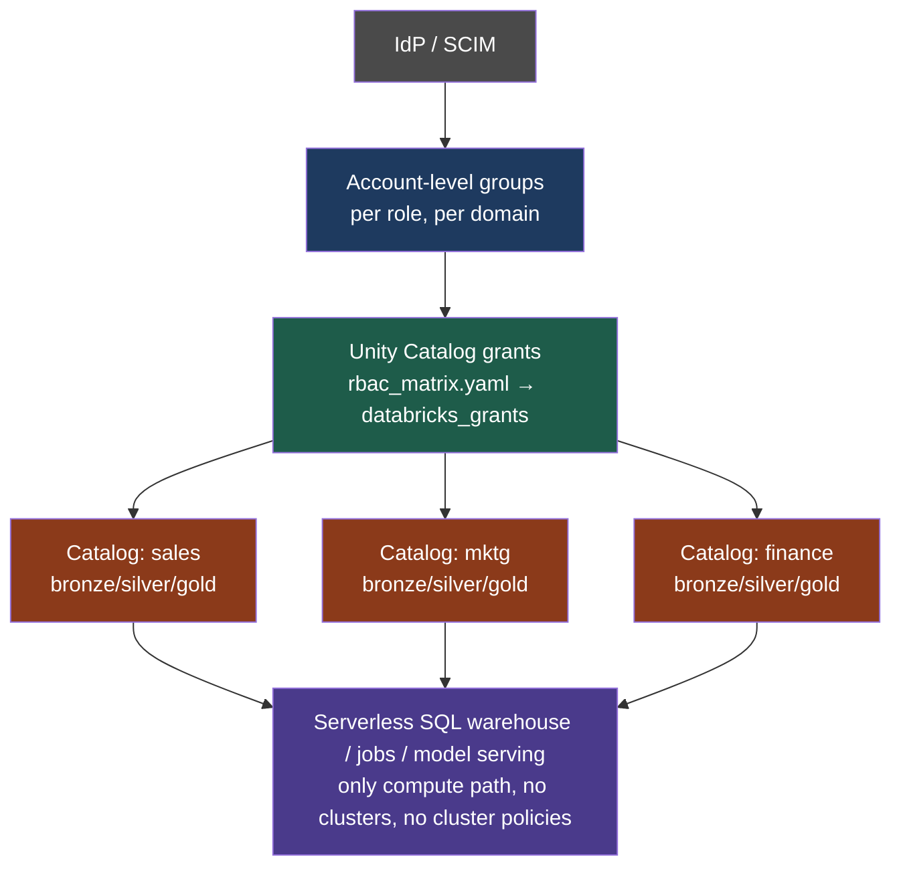

# RBAC Architecture Diagram

```mermaid
flowchart TD
    A["IdP / SCIM"]
    B["Account-level groups<br/>per role, per domain"]
    C["Unity Catalog grants<br/>rbac_matrix.yaml → databricks_grants"]
    D1["Catalog: sales<br/>bronze/silver/gold"]
    D2["Catalog: mktg<br/>bronze/silver/gold"]
    D3["Catalog: finance<br/>bronze/silver/gold"]
    E["Serverless SQL warehouse / jobs / model serving<br/>only compute path, no clusters, no cluster policies"]

    A --> B
    B --> C
    C --> D1
    C --> D2
    C --> D3
    D1 --> E
    D2 --> E
    D3 --> E

    style A fill:#4a4a4a,color:#fff
    style B fill:#1e3a5f,color:#fff
    style C fill:#1e5c4a,color:#fff
    style D1 fill:#8b3a1a,color:#fff
    style D2 fill:#8b3a1a,color:#fff
    style D3 fill:#8b3a1a,color:#fff
    style E fill:#4a3a8b,color:#fff
```

Data engineers, scientists, analysts, and BAs all authenticate the same way.
