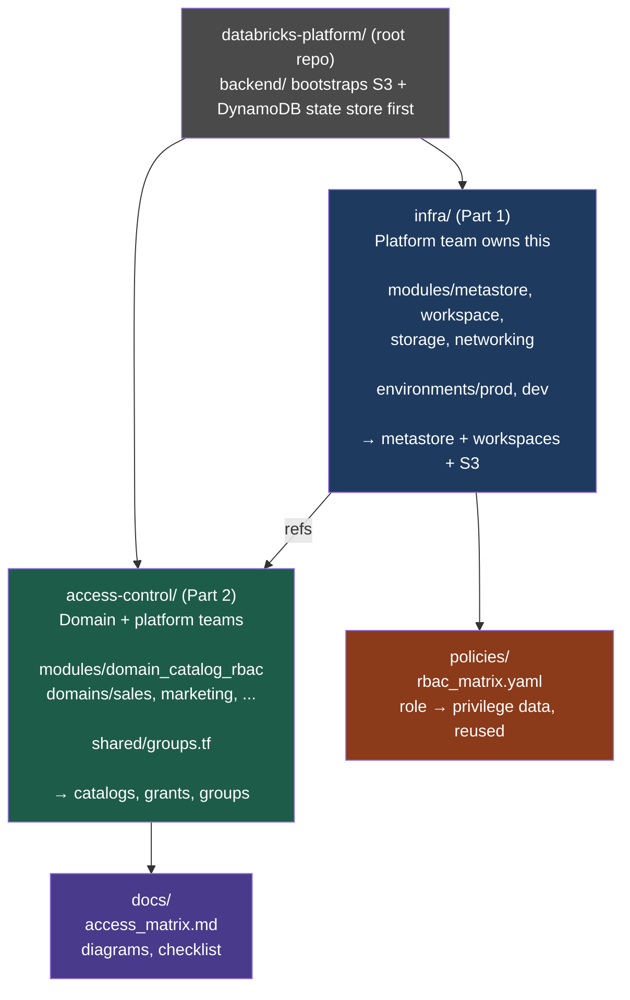

# Repo Structure Diagram

```mermaid
flowchart TD
    A["databricks-platform/ (root repo)<br/>backend/ bootstraps S3 + DynamoDB state store first"]
    B["infra/ (Part 1)<br/>Platform team owns this<br/><br/>modules/metastore, workspace,<br/>storage, networking<br/><br/>environments/prod, dev<br/><br/>→ metastore + workspaces + S3"]
    C["access-control/ (Part 2)<br/>Domain + platform teams<br/><br/>modules/domain_catalog_rbac<br/>domains/sales, marketing, ...<br/><br/>shared/groups.tf<br/><br/>→ catalogs, grants, groups"]
    D["policies/<br/>rbac_matrix.yaml<br/>role → privilege data, reused"]
    E["docs/<br/>access_matrix.md<br/>diagrams, checklist"]

    A --> B
    A --> C
    B -- refs --> C
    B --> D
    C --> E

    style A fill:#4a4a4a,color:#fff
    style B fill:#1e3a5f,color:#fff
    style C fill:#1e5c4a,color:#fff
    style D fill:#8b3a1a,color:#fff
    style E fill:#4a3a8b,color:#fff
```

policies/rbac_matrix.yaml is consumed by access-control/modules/domain_catalog_rbac, so every domain gets identical role logic with zero duplication.
